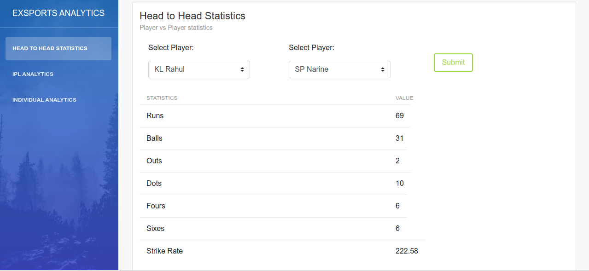

<h1 align="center">:memo::chart_with_upwards_trend: Exsports Analytics :cricket::bar_chart:</h1>

 

 

---

<b>Submission for DJ-ACM's LOC Hackathon 2020.</b> 

<h2>Motivation:</h2>

Sports Analytics is becoming increasingly famous, with top sports teams tying up with top analytics companies to gain more insights about not only their team, but to also discover hidden patterns in the data of other teams in order to optimize their game plans and also develop a better understanding. We chose this domain because it is relatively new and we wanted to try our hands on it.

### Features:

* [x] Dashboard for team coaches consisting of various statistics about the game in general.
* [x] Provide predictions about performance of a player based on numerous parameters like country, ground, time, ball faced, etc. 
* [x] Squad (Playing XI) Prediction feature for a team using K-means clustering. 
* [x] Player vs Player head-on statistics. 
* [x] Team vs Team performance in recent years. 
* [x] Mobile-view support.

---

<h3 align="center">Exsports Analytics as a webapp:</h3>

<h4 align="center">Landing Page</h4>

 
<h4 align="center">Bowler's statistics</h4>

 
<h4 align="center">Player Individual Statistics</h4>

 
<h4 align="center">Predicting a batsman's performance</h4>

 
<h4 align="center">Head-to-head Statistics</h4>

 
<h4 align="center">Team vs Team Prediction</h4>

 
<h4 align="center">Squad Prediction using K-means Clustering</h4>

 

 

---

### Future scope of this project:

* [ ] Provide more comprehensive data analysis for each team. 
* [ ] Provide partial prediction for squad, building the team around the few players selected by coach. 
* [ ] Provide insights based on graphs. (For eg: the AI system saying that player X is slow in pitch Y against team Z.)
* [ ] With availability of more datasets, convert this project into a full-fledged software. 
* [ ] Used advanced machine learning algorithms ffor squad predictions on a large number of parameters and extracting insights. 

### Tech Stack of this Project:

* Frontend: HTML, CSS, JavaScript, Bootstrap4
* Backend: Python3
* Framework: Django
* Machine Learning Model: K-means Clustering (sklearn)
* Libraries: Available in [requirements.txt](https://github.com/nachiketbhuta/exsports-analytics/blob/master/requirements.txt).

### To run the project:

* [Fork](https://github.com/nachiketbhuta/exsports-analytics) this Repository.
* Change into he directory in the terminal and run as:
  -`pip3 install -r requirements.txt`
  -`python3 manage.py runserver`
* Open your web browser and enter the following URL:
`localhost:8000`

#### This project still has scope of development, so you can also contribute to this Project as follows:
* [Fork](https://github.com/nachiketbhuta/exsports-analytics) this Repository.
* Clone your Fork on a different branch:
	* `git clone -b <name-of-branch> https://github.com/zenilharia26/KhaanDaan.git`
* After adding any feature:
	* Goto your fork and create a pull request.
	* We will test your modifications and merge changes.

This project was done as a part of DJ-ACM LOC Hackathon 2020 `with no pre-preparation in less than 24 hours.`

---
<h3 align="center"><b>Developed with :heart: by Team Reunited.</b></h1>
